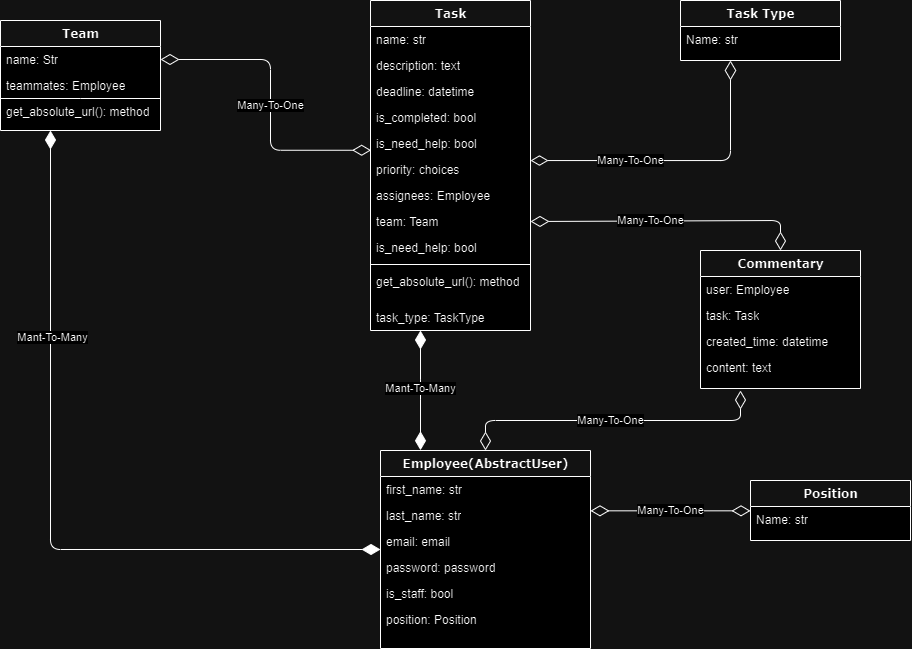
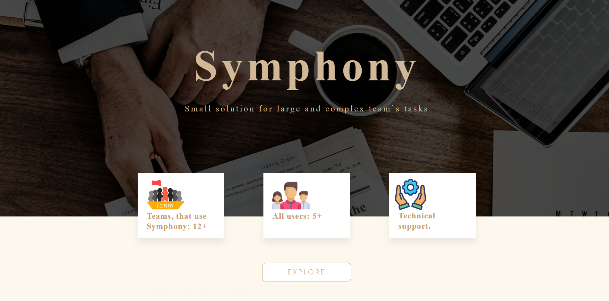
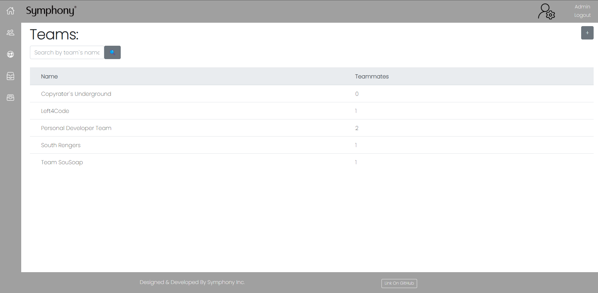
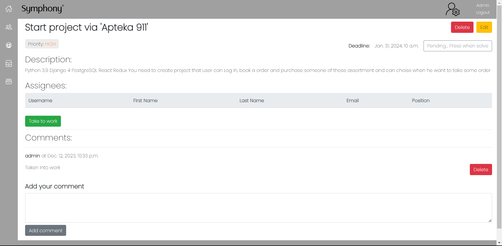

# IT-company-task-manager

Django project wit user-friendly interface for teams, where users can solve team`s and own task

## Check It Out!

link

## Database Structure



## Installation

Python3 must be already installed

```shell
git clone https://github.com/VladyslavOladko/IT-company-task-manager.git
cd IT-company-task-manager
python3 -m venv venv
source venv/Scripts/activate
pip install -r requirements.txt
python manage.py runserver
```

## Features

* Registration and authentication functionality for all users
* Admin permissions for Lead of team, which they can create team and update team name and teammates in team
* Ordinary users can create tasks to team and solve tasks assigned by other users or Lead of team
* You can write the comment if you don`t know something about task and ask for help

## Demo





